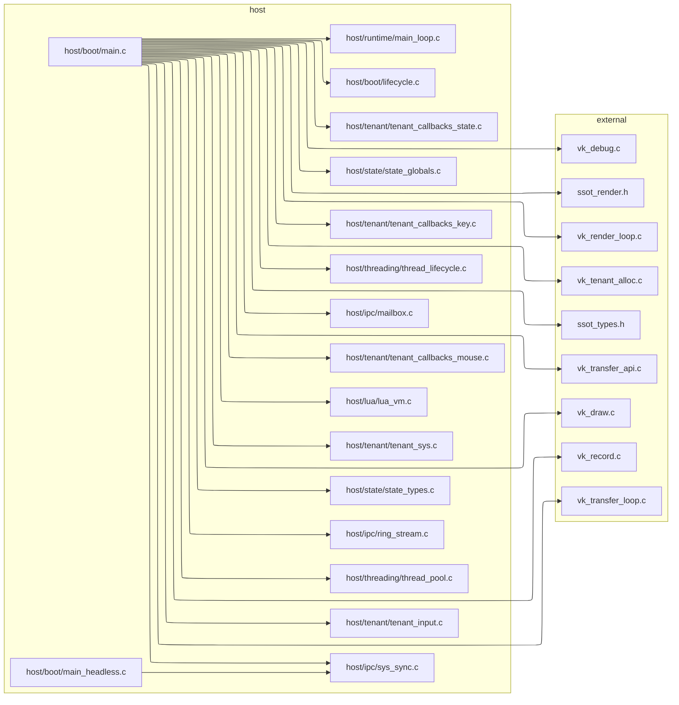

```mermaid
%%{init: {"flowchart": {"defaultRenderer": "elk"}}}%%
flowchart LR
    %% WeaverEngine C Dependencies
    subgraph external
        ssot_render_h["ssot_render.h"]
        ssot_types_h["ssot_types.h"]
        vk_debug_c["vk_debug.c"]
        vk_draw_c["vk_draw.c"]
        vk_record_c["vk_record.c"]
        vk_render_loop_c["vk_render_loop.c"]
        vk_tenant_alloc_c["vk_tenant_alloc.c"]
        vk_transfer_api_c["vk_transfer_api.c"]
        vk_transfer_loop_c["vk_transfer_loop.c"]
    end
    subgraph host
        host_boot_lifecycle_c["host/boot/lifecycle.c"]
        host_boot_main_c["host/boot/main.c"]
        host_boot_main_headless_c["host/boot/main_headless.c"]
        host_ipc_mailbox_c["host/ipc/mailbox.c"]
        host_ipc_ring_stream_c["host/ipc/ring_stream.c"]
        host_ipc_sys_sync_c["host/ipc/sys_sync.c"]
        host_lua_lua_vm_c["host/lua/lua_vm.c"]
        host_runtime_main_loop_c["host/runtime/main_loop.c"]
        host_state_state_globals_c["host/state/state_globals.c"]
        host_state_state_types_c["host/state/state_types.c"]
        host_tenant_tenant_callbacks_key_c["host/tenant/tenant_callbacks_key.c"]
        host_tenant_tenant_callbacks_mouse_c["host/tenant/tenant_callbacks_mouse.c"]
        host_tenant_tenant_callbacks_state_c["host/tenant/tenant_callbacks_state.c"]
        host_tenant_tenant_input_c["host/tenant/tenant_input.c"]
        host_tenant_tenant_sys_c["host/tenant/tenant_sys.c"]
        host_threading_thread_lifecycle_c["host/threading/thread_lifecycle.c"]
        host_threading_thread_pool_c["host/threading/thread_pool.c"]
    end
    host_boot_main_c --> host_boot_lifecycle_c
    host_boot_main_c --> host_ipc_mailbox_c
    host_boot_main_c --> host_ipc_ring_stream_c
    host_boot_main_c --> host_ipc_sys_sync_c
    host_boot_main_c --> host_lua_lua_vm_c
    host_boot_main_c --> host_runtime_main_loop_c
    host_boot_main_c --> host_state_state_globals_c
    host_boot_main_c --> host_state_state_types_c
    host_boot_main_c --> host_tenant_tenant_callbacks_key_c
    host_boot_main_c --> host_tenant_tenant_callbacks_mouse_c
    host_boot_main_c --> host_tenant_tenant_callbacks_state_c
    host_boot_main_c --> host_tenant_tenant_input_c
    host_boot_main_c --> host_tenant_tenant_sys_c
    host_boot_main_c --> host_threading_thread_lifecycle_c
    host_boot_main_c --> host_threading_thread_pool_c
    host_boot_main_c --> ssot_render_h
    host_boot_main_c --> ssot_types_h
    host_boot_main_c --> vk_debug_c
    host_boot_main_c --> vk_draw_c
    host_boot_main_c --> vk_record_c
    host_boot_main_c --> vk_render_loop_c
    host_boot_main_c --> vk_tenant_alloc_c
    host_boot_main_c --> vk_transfer_api_c
    host_boot_main_c --> vk_transfer_loop_c
    host_boot_main_headless_c --> host_ipc_sys_sync_c
```
