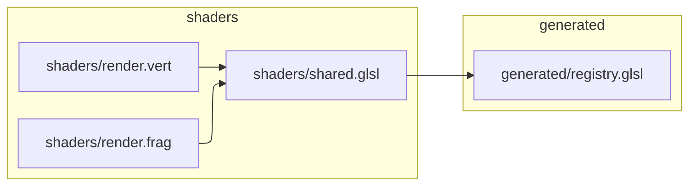

```mermaid
%%{init: {"flowchart": {"defaultRenderer": "elk"}}}%%
flowchart LR
    %% WeaverEngine GLSL Dependencies
    subgraph generated
        generated_registry_glsl["generated/registry.glsl"]
    end
    subgraph shaders
        shaders_render_frag["shaders/render.frag"]
        shaders_render_vert["shaders/render.vert"]
        shaders_shared_glsl["shaders/shared.glsl"]
    end
    shaders_render_frag --> shaders_shared_glsl
    shaders_render_vert --> shaders_shared_glsl
    shaders_shared_glsl --> generated_registry_glsl
```
