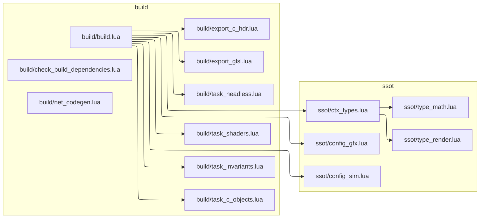

```mermaid
%%{init: {"flowchart": {"defaultRenderer": "elk"}}}%%
flowchart LR
    %% WeaverEngine Lua Dependencies
    subgraph build
        build_build_lua["build/build.lua"]
        build_check_build_dependencies_lua["build/check_build_dependencies.lua"]
        build_export_c_hdr_lua["build/export_c_hdr.lua"]
        build_export_glsl_lua["build/export_glsl.lua"]
        build_net_codegen_lua["build/net_codegen.lua"]
        build_task_c_objects_lua["build/task_c_objects.lua"]
        build_task_headless_lua["build/task_headless.lua"]
        build_task_invariants_lua["build/task_invariants.lua"]
        build_task_shaders_lua["build/task_shaders.lua"]
    end
    subgraph ssot
        ssot_config_gfx_lua["ssot/config_gfx.lua"]
        ssot_config_sim_lua["ssot/config_sim.lua"]
        ssot_ctx_types_lua["ssot/ctx_types.lua"]
        ssot_type_math_lua["ssot/type_math.lua"]
        ssot_type_render_lua["ssot/type_render.lua"]
    end
    build_build_lua --> build_export_c_hdr_lua
    build_build_lua --> build_export_glsl_lua
    build_build_lua --> build_task_c_objects_lua
    build_build_lua --> build_task_headless_lua
    build_build_lua --> build_task_invariants_lua
    build_build_lua --> build_task_shaders_lua
    build_build_lua --> ssot_config_gfx_lua
    build_build_lua --> ssot_config_sim_lua
    build_build_lua --> ssot_ctx_types_lua
    ssot_ctx_types_lua --> ssot_type_math_lua
    ssot_ctx_types_lua --> ssot_type_render_lua
```
