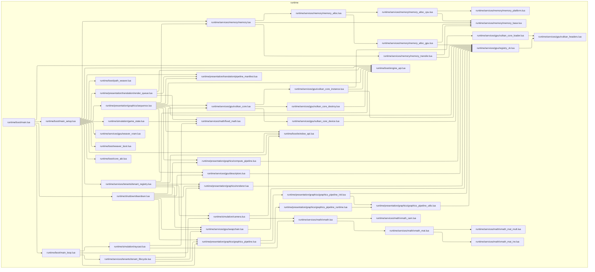

```mermaid
%%{init: {"flowchart": {"defaultRenderer": "elk"}}}%%
flowchart LR
    %% WeaverEngine Lua Dependencies
    subgraph runtime
        runtime_boot_core_abi_lua["runtime/boot/core_abi.lua"]
        runtime_boot_engine_api_lua["runtime/boot/engine_api.lua"]
        runtime_boot_main_lua["runtime/boot/main.lua"]
        runtime_boot_main_loop_lua["runtime/boot/main_loop.lua"]
        runtime_boot_main_setup_lua["runtime/boot/main_setup.lua"]
        runtime_boot_path_weaver_lua["runtime/boot/path_weaver.lua"]
        runtime_boot_weaver_boot_lua["runtime/boot/weaver_boot.lua"]
        runtime_boot_window_api_lua["runtime/boot/window_api.lua"]
        runtime_presentation_graphics_compute_pipeline_lua["runtime/presentation/graphics/compute_pipeline.lua"]
        runtime_presentation_graphics_graphics_pipeline_lua["runtime/presentation/graphics/graphics_pipeline.lua"]
        runtime_presentation_graphics_graphics_pipeline_init_lua["runtime/presentation/graphics/graphics_pipeline_init.lua"]
        runtime_presentation_graphics_graphics_pipeline_runtime_lua["runtime/presentation/graphics/graphics_pipeline_runtime.lua"]
        runtime_presentation_graphics_graphics_pipeline_utils_lua["runtime/presentation/graphics/graphics_pipeline_utils.lua"]
        runtime_presentation_graphics_renderer_lua["runtime/presentation/graphics/renderer.lua"]
        runtime_presentation_graphics_sequence_lua["runtime/presentation/graphics/sequence.lua"]
        runtime_presentation_translation_pipeline_manifest_lua["runtime/presentation/translation/pipeline_manifest.lua"]
        runtime_presentation_translation_render_queue_lua["runtime/presentation/translation/render_queue.lua"]
        runtime_services_gpu_descriptors_lua["runtime/services/gpu/descriptors.lua"]
        runtime_services_gpu_registry_vk_lua["runtime/services/gpu/registry_vk.lua"]
        runtime_services_gpu_swapchain_lua["runtime/services/gpu/swapchain.lua"]
        runtime_services_gpu_vulkan_core_lua["runtime/services/gpu/vulkan_core.lua"]
        runtime_services_gpu_vulkan_core_destroy_lua["runtime/services/gpu/vulkan_core_destroy.lua"]
        runtime_services_gpu_vulkan_core_device_lua["runtime/services/gpu/vulkan_core_device.lua"]
        runtime_services_gpu_vulkan_core_instance_lua["runtime/services/gpu/vulkan_core_instance.lua"]
        runtime_services_gpu_vulkan_core_loader_lua["runtime/services/gpu/vulkan_core_loader.lua"]
        runtime_services_gpu_vulkan_headers_lua["runtime/services/gpu/vulkan_headers.lua"]
        runtime_services_gpu_weaver_vram_lua["runtime/services/gpu/weaver_vram.lua"]
        runtime_services_math_fixed_math_lua["runtime/services/math/fixed_math.lua"]
        runtime_services_math_vmath_lua["runtime/services/math/vmath.lua"]
        runtime_services_math_vmath_cam_lua["runtime/services/math/vmath_cam.lua"]
        runtime_services_math_vmath_mat_lua["runtime/services/math/vmath_mat.lua"]
        runtime_services_math_vmath_mat_inv_lua["runtime/services/math/vmath_mat_inv.lua"]
        runtime_services_math_vmath_mat_mult_lua["runtime/services/math/vmath_mat_mult.lua"]
        runtime_services_memory_memory_lua["runtime/services/memory/memory.lua"]
        runtime_services_memory_memory_alloc_lua["runtime/services/memory/memory_alloc.lua"]
        runtime_services_memory_memory_alloc_cpu_lua["runtime/services/memory/memory_alloc_cpu.lua"]
        runtime_services_memory_memory_alloc_gpu_lua["runtime/services/memory/memory_alloc_gpu.lua"]
        runtime_services_memory_memory_base_lua["runtime/services/memory/memory_base.lua"]
        runtime_services_memory_memory_platform_lua["runtime/services/memory/memory_platform.lua"]
        runtime_services_memory_memory_transfer_lua["runtime/services/memory/memory_transfer.lua"]
        runtime_services_tenants_tenant_lifecycle_lua["runtime/services/tenants/tenant_lifecycle.lua"]
        runtime_services_tenants_tenant_registry_lua["runtime/services/tenants/tenant_registry.lua"]
        runtime_shutdown_teardown_lua["runtime/shutdown/teardown.lua"]
        runtime_simulation_camera_lua["runtime/simulation/camera.lua"]
        runtime_simulation_game_state_lua["runtime/simulation/game_state.lua"]
        runtime_simulation_raycast_lua["runtime/simulation/raycast.lua"]
    end
    runtime_boot_main_lua --> runtime_boot_engine_api_lua
    runtime_boot_main_lua --> runtime_boot_main_loop_lua
    runtime_boot_main_lua --> runtime_boot_main_setup_lua
    runtime_boot_main_lua --> runtime_shutdown_teardown_lua
    runtime_boot_main_loop_lua --> runtime_services_tenants_tenant_lifecycle_lua
    runtime_boot_main_loop_lua --> runtime_simulation_camera_lua
    runtime_boot_main_loop_lua --> runtime_simulation_raycast_lua
    runtime_boot_main_setup_lua --> runtime_boot_core_abi_lua
    runtime_boot_main_setup_lua --> runtime_boot_engine_api_lua
    runtime_boot_main_setup_lua --> runtime_boot_path_weaver_lua
    runtime_boot_main_setup_lua --> runtime_boot_weaver_boot_lua
    runtime_boot_main_setup_lua --> runtime_boot_window_api_lua
    runtime_boot_main_setup_lua --> runtime_presentation_graphics_graphics_pipeline_lua
    runtime_boot_main_setup_lua --> runtime_presentation_graphics_sequence_lua
    runtime_boot_main_setup_lua --> runtime_presentation_translation_pipeline_manifest_lua
    runtime_boot_main_setup_lua --> runtime_presentation_translation_render_queue_lua
    runtime_boot_main_setup_lua --> runtime_services_gpu_weaver_vram_lua
    runtime_boot_main_setup_lua --> runtime_services_memory_memory_lua
    runtime_boot_main_setup_lua --> runtime_services_tenants_tenant_registry_lua
    runtime_boot_main_setup_lua --> runtime_simulation_game_state_lua
    runtime_presentation_graphics_compute_pipeline_lua --> runtime_services_gpu_registry_vk_lua
    runtime_presentation_graphics_graphics_pipeline_lua --> runtime_presentation_graphics_graphics_pipeline_init_lua
    runtime_presentation_graphics_graphics_pipeline_lua --> runtime_presentation_graphics_graphics_pipeline_runtime_lua
    runtime_presentation_graphics_graphics_pipeline_init_lua --> runtime_presentation_graphics_graphics_pipeline_utils_lua
    runtime_presentation_graphics_graphics_pipeline_init_lua --> runtime_services_gpu_registry_vk_lua
    runtime_presentation_graphics_graphics_pipeline_runtime_lua --> runtime_presentation_graphics_graphics_pipeline_utils_lua
    runtime_presentation_graphics_graphics_pipeline_utils_lua --> runtime_services_gpu_registry_vk_lua
    runtime_presentation_graphics_renderer_lua --> runtime_services_gpu_registry_vk_lua
    runtime_presentation_graphics_sequence_lua --> runtime_boot_engine_api_lua
    runtime_presentation_graphics_sequence_lua --> runtime_boot_window_api_lua
    runtime_presentation_graphics_sequence_lua --> runtime_presentation_graphics_compute_pipeline_lua
    runtime_presentation_graphics_sequence_lua --> runtime_presentation_translation_pipeline_manifest_lua
    runtime_presentation_graphics_sequence_lua --> runtime_services_gpu_descriptors_lua
    runtime_presentation_graphics_sequence_lua --> runtime_services_gpu_registry_vk_lua
    runtime_presentation_graphics_sequence_lua --> runtime_services_gpu_vulkan_core_lua
    runtime_presentation_graphics_sequence_lua --> runtime_services_memory_memory_lua
    runtime_presentation_translation_render_queue_lua --> runtime_boot_engine_api_lua
    runtime_presentation_translation_render_queue_lua --> runtime_presentation_translation_pipeline_manifest_lua
    runtime_presentation_translation_render_queue_lua --> runtime_services_math_fixed_math_lua
    runtime_services_gpu_descriptors_lua --> runtime_services_gpu_registry_vk_lua
    runtime_services_gpu_registry_vk_lua --> runtime_services_gpu_vulkan_headers_lua
    runtime_services_gpu_swapchain_lua --> runtime_services_gpu_registry_vk_lua
    runtime_services_gpu_vulkan_core_lua --> runtime_services_gpu_vulkan_core_destroy_lua
    runtime_services_gpu_vulkan_core_lua --> runtime_services_gpu_vulkan_core_device_lua
    runtime_services_gpu_vulkan_core_lua --> runtime_services_gpu_vulkan_core_instance_lua
    runtime_services_gpu_vulkan_core_destroy_lua --> runtime_boot_engine_api_lua
    runtime_services_gpu_vulkan_core_device_lua --> runtime_services_gpu_registry_vk_lua
    runtime_services_gpu_vulkan_core_instance_lua --> runtime_boot_engine_api_lua
    runtime_services_gpu_vulkan_core_instance_lua --> runtime_services_gpu_registry_vk_lua
    runtime_services_gpu_vulkan_core_instance_lua --> runtime_services_gpu_vulkan_core_loader_lua
    runtime_services_gpu_vulkan_core_loader_lua --> runtime_services_gpu_vulkan_headers_lua
    runtime_services_math_vmath_lua --> runtime_services_math_vmath_cam_lua
    runtime_services_math_vmath_lua --> runtime_services_math_vmath_mat_lua
    runtime_services_math_vmath_mat_lua --> runtime_services_math_vmath_mat_inv_lua
    runtime_services_math_vmath_mat_lua --> runtime_services_math_vmath_mat_mult_lua
    runtime_services_memory_memory_lua --> runtime_services_memory_memory_alloc_lua
    runtime_services_memory_memory_lua --> runtime_services_memory_memory_base_lua
    runtime_services_memory_memory_lua --> runtime_services_memory_memory_transfer_lua
    runtime_services_memory_memory_alloc_lua --> runtime_services_memory_memory_alloc_cpu_lua
    runtime_services_memory_memory_alloc_lua --> runtime_services_memory_memory_alloc_gpu_lua
    runtime_services_memory_memory_alloc_cpu_lua --> runtime_services_memory_memory_base_lua
    runtime_services_memory_memory_alloc_cpu_lua --> runtime_services_memory_memory_platform_lua
    runtime_services_memory_memory_alloc_gpu_lua --> runtime_services_gpu_registry_vk_lua
    runtime_services_memory_memory_alloc_gpu_lua --> runtime_services_memory_memory_base_lua
    runtime_services_memory_memory_transfer_lua --> runtime_services_gpu_registry_vk_lua
    runtime_services_memory_memory_transfer_lua --> runtime_services_memory_memory_base_lua
    runtime_services_tenants_tenant_lifecycle_lua --> runtime_presentation_graphics_graphics_pipeline_lua
    runtime_services_tenants_tenant_lifecycle_lua --> runtime_presentation_graphics_renderer_lua
    runtime_services_tenants_tenant_lifecycle_lua --> runtime_services_gpu_swapchain_lua
    runtime_services_tenants_tenant_registry_lua --> runtime_boot_engine_api_lua
    runtime_services_tenants_tenant_registry_lua --> runtime_boot_window_api_lua
    runtime_services_tenants_tenant_registry_lua --> runtime_presentation_graphics_renderer_lua
    runtime_services_tenants_tenant_registry_lua --> runtime_services_gpu_swapchain_lua
    runtime_services_tenants_tenant_registry_lua --> runtime_simulation_camera_lua
    runtime_shutdown_teardown_lua --> runtime_presentation_graphics_compute_pipeline_lua
    runtime_shutdown_teardown_lua --> runtime_presentation_graphics_graphics_pipeline_lua
    runtime_shutdown_teardown_lua --> runtime_presentation_graphics_renderer_lua
    runtime_shutdown_teardown_lua --> runtime_services_gpu_descriptors_lua
    runtime_shutdown_teardown_lua --> runtime_services_gpu_swapchain_lua
    runtime_shutdown_teardown_lua --> runtime_services_gpu_vulkan_core_lua
    runtime_simulation_camera_lua --> runtime_boot_window_api_lua
    runtime_simulation_camera_lua --> runtime_services_math_vmath_lua
    runtime_simulation_game_state_lua --> runtime_services_math_fixed_math_lua
    runtime_simulation_raycast_lua --> runtime_services_math_fixed_math_lua
    runtime_simulation_raycast_lua --> runtime_services_math_vmath_lua
```
